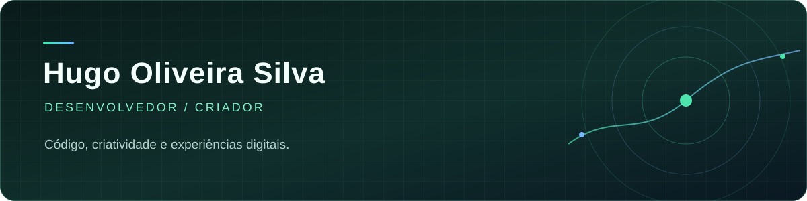

  

   

  
<strong>Desenvolvimento web · jogos · projetos com propósito</strong>

  

    <a href="https://devhugo-os.github.io/Portfolio/">Portfólio</a> ·
    <a href="https://github.com/devhugo-os?tab=repositories">Repositórios</a> ·
    <a href="https://rhjava.itch.io/mirror-jump">Mirror Jump no itch.io</a>
  

---

### Oi, eu sou o Hugo 👋

Gosto de transformar ideias em experiências que as pessoas possam usar, explorar e jogar. Entre interfaces web, APIs e jogos 2D, procuro unir lógica, identidade visual e interação. Meus projetos passam por educação, ferramentas para comunidades e experimentos com jogos.

> “O código é a ferramenta mais poderosa para contar histórias interativas.”

### Projetos em destaque

| Projeto | O que é | Tecnologias |
| :--- | :--- | :--- |
| [Kicker-Hax](https://github.com/devhugo-os/Kicker-Hax) | Jogo de futebol para navegador inspirado em Haxball, com foco em partidas e experiência multijogador. | JavaScript · Web |
| [Champions Chess INFO](https://github.com/devhugo-os/Champions-Chess-INFO) | Ferramenta e materiais para organizar um campeonato interno de xadrez do IFMA, Campus Açailândia. | JavaScript · Web |
| [Portfólio](https://github.com/devhugo-os/Portfolio) | Meu espaço para apresentar projetos, habilidades e experimentos. | JavaScript · HTML · CSS |
| [NeuroSys](https://github.com/Rhuan-cmd/NeuroSys) | Jogo colaborativo de terror psicológico em pixel art sobre cyberbullying. | GameMaker · GML |

### O que estou explorando

`JavaScript` `Node.js` `Java` `Python` `HTML` `CSS` `GameMaker` `APIs` `Jogos 2D`

Tenho trabalhado também em projetos privados de **tecnologia para educação e meio ambiente**, **sistemas em Java** e **protótipos de jogos**. Eles ajudam a orientar o que construo e aprendo, mesmo quando o código ainda não está público.

### Fora do código

Gosto de criar jogos com uma ideia clara por trás. [Mirror Jump](https://rhjava.itch.io/mirror-jump) nasceu em uma game jam; **English Today** explora o aprendizado de inglês de forma lúdica.

   
  <a href="https://devhugo-os.github.io/Portfolio/"><strong>Conheça meu portfólio →</strong></a>

